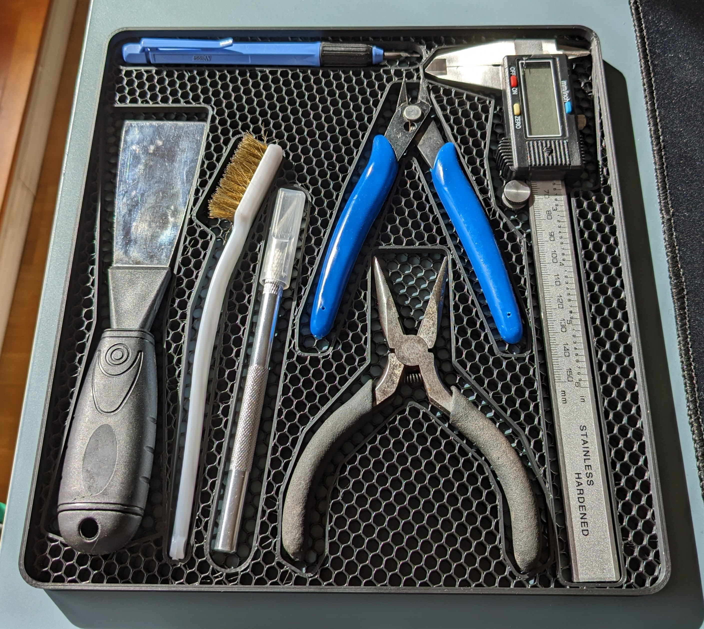

In this project I try to generate vector files from photos to generate tool trays with good fit for irregular shaped objects

# CS50 FINAL PROJECT

The project goal is to generate vector files with object outlines from high contrast photos. 
These outlines can be used in CAD-Software to generate tool trays, that can be 3D-printed. 
It is quite tedious to draw object outlines in CAD, therefore I wanted to automate the process. 

The photos require a high contrast between the objects and background. Its best to take the photos from far away and zoomed in, to avoid distortions. 

### Example tray 

Tray for 3D printer Tools

## Why use chroma key method instead of treshold method like Otsu?

When detecting multiple objects with different objects the treshold method for contour detection becomes unreliable. Sometimes it breakes for a single object when this object is made from different colored materials. Therefore I opted for a more robust chroma keying approach.