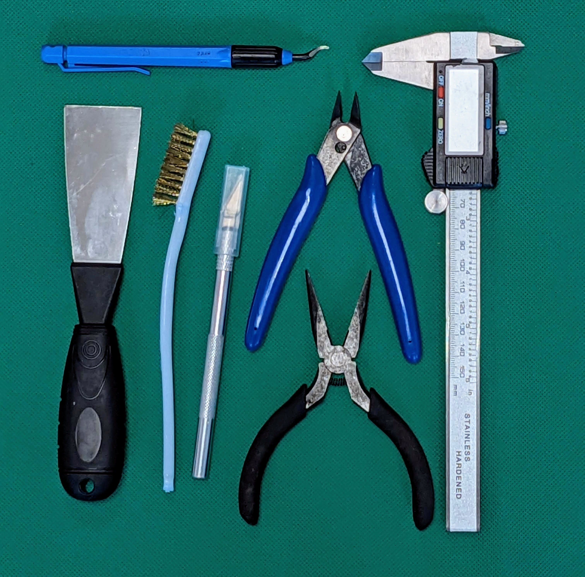
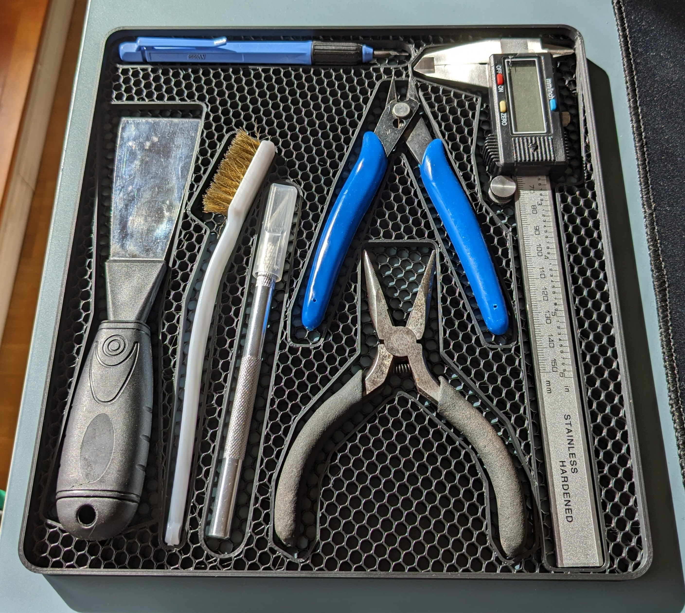

# Image to Object Outline

## CS50 Final Project: Automated CAD Outline Generation
Welcome to my CS50 final project! This application is designed to simplify the process of creating object outlines for use in CAD software.

Drawing outlines manually in CAD software can be quite tedious, especially when dealing with complex shapes or a large number of objects. My goal was to automate this process to save time and increase efficiency.

## Quick Start

1. Choose or upload an image to the application.
2. Follow the on-screen instructions to process the image and generate outlines.
3. Download the DXF file and proceed with your CAD design.

## Design
- Python-based: The entire application is written in Python, making it easily accessible and modifiable.
- Web Interface: Utilizes Streamlit to provide a user-friendly web interface.
- Image Processing: Implements openCV and Pillow (PIL) for robust image processing.
- Calculations: Uses Numpy for all backend calculations.
- DXF Generation: Uses ezdxf to generate DXF files that are compatible with popular CAD software like Autodesk Fusion 360.

## Getting Started
To use this application, you will need an image of the objects you want to outline. You can either upload an image, take one with your camera, or use the provided example photo to get started.

## Image Requirements
If you take a picture by yourself, there are some Requirements to it: 

- Even Lighting: Objects should be evenly lit to avoid sharp shadows.
- Contrasting Background: The background should contrast significantly with the object to ensure accurate detection. The Background should have a well separated color from all the objects in your image
- Minimal Distortion: For best results, take the image from a distance and zoom in to minimize perspective distortion.

  
   
  <em>Example Image</em>

## Workflow
### Image Preprocessing
The first step involves creating a mask to separate the objects from the background. This is done by:

1. Extracting the background color.
2. Filtering by the background color range.
3. Optionally reducing the number of colors to enhance contrast.
4. Blurring the image slightly to reduce noise.
5. Outline Generation

### Outline Detection
After preprocessing, the following steps are taken to create the object outlines:

1. Input the number of objects in your image.
2. Adjust the mask with sliders to fine-tune the results.
3. Increase the size of the outlines if needed (useful for creating trays or inserts).
4. Reduce the number of points in the outlines for easier manipulation in CAD software.
5. Scaling to Real Life Size

    To ensure the outlines match the real dimensions of the objects:

    - Select two points with a known distance between them.
    - Input the measured distance to scale the outlines accurately.
Finalizing
Download the generated DXF file and import it into your preferred CAD software.

### Example Use Case
In this project, I demonstrate how to create a custom tray for 3D printer tools. The outlines need to be slightly larger than the actual tools to ensure a proper fit, and I show how to adjust for these considerations.

### Try It Out
Ready to automate your CAD drawing process? Click the badge below to get started!

## Discussion

### Object Extraction via Chroma Keying

Utilizing a technique similar to chroma keying, commonly used in movie production, this application effectively extracts objects from the background. While simpler algorithms struggled with materials and colors, chroma keying proved to be robust for a variety of objects and their diverse properties.

Photogrammetry was considered as an alternative, which offers the added benefit of capturing object depth. However, the workflow is cumbersome, requiring multiple images from various angles, and it falls short with reflective materials. Additionally, the computational intensity of photogrammetry posed potential problems for a web-based application.

### User Interaction in Background Isolation

The current workflow requires the user to reposition the selection square on the background with each image modification, such as applying blur or color reduction. This might be due to an unexpexted behavior in the used cropping function. (See https://github.com/turner-anderson/streamlit-cropper/issues/29)

### Outline Scaling Methodology

Several automated scaling methods were contemplated, including the use of predefined markers or known-sized objects like coins. To maintain project focus, these ideas were set aside. The adopted method involves the user measuring a known distance on the object, which balances automation with simplicity and effectiveness.

### Outline Detection and Refinement

The app employs OpenCV's contour detection to locate object outlines, selectively picking on the largest shapes (by area). This method is generally reliable but may encounter challenges in scenarios where objects are nested within others. In such special cases, additional user guidance might be necessary to achieve optimal results.

## Acknowledgements
Special thanks to CS50 for providing the educational foundation for this project, and to all the open-source libraries that made this possible.

Enjoy streamlining your CAD workflow!

## Example Result 

Tray for 3D printer Tools
